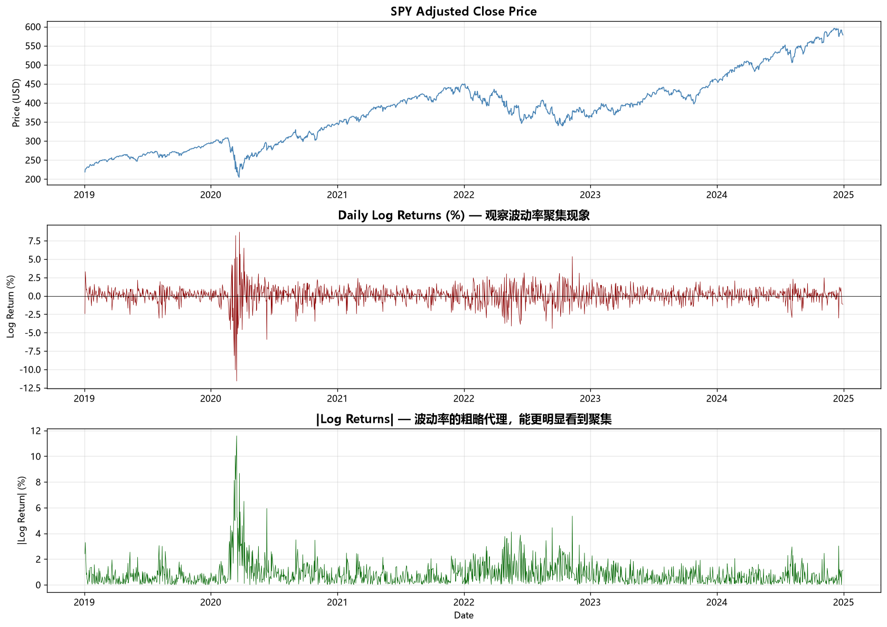
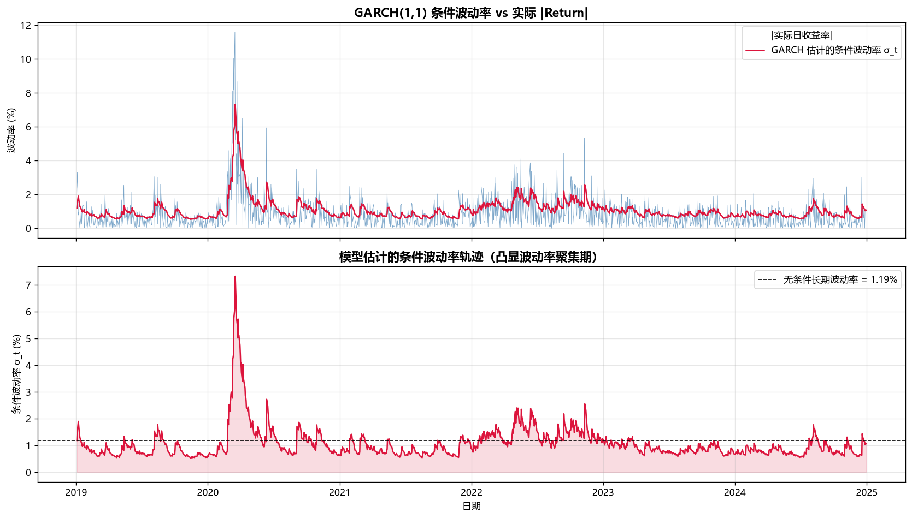
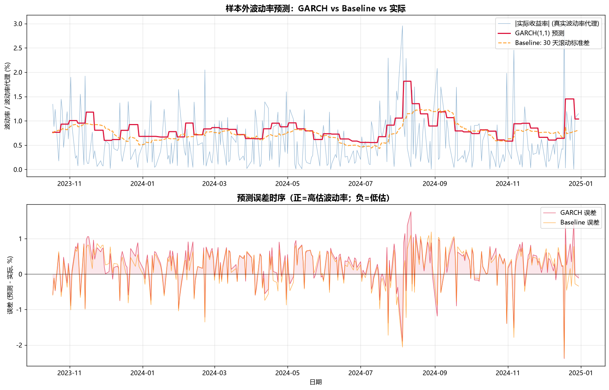
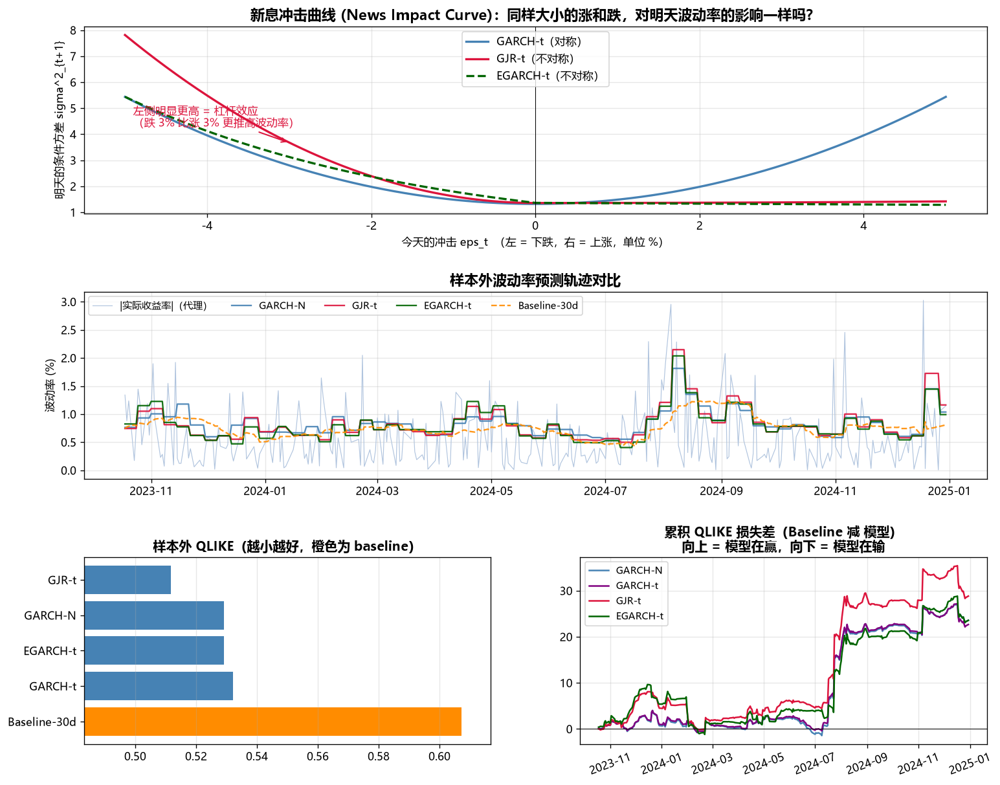

# SPY 波动率预测：GARCH 族模型的杠杆效应与评价方法

用 1508 个交易日的 SPY 数据，比较 GARCH(1,1)、GJR-GARCH、EGARCH 在**样本外**波动率预测上的表现，
并讨论一个常被忽略的问题：**换一个损失函数，模型排名会反过来。**

> 自主项目 | Python | 2026-09

---

## 一句话结论

在 302 天的 walk-forward 回测中，GARCH 族模型在 **QLIKE** 损失下全部优于 30 天滚动标准差基准，
但在 **MSE** 下反而不如它；Diebold-Mariano 检验显示这些差距**在统计上均不显著**（p ≈ 0.11–0.15）。
**在风险管理场景应以 QLIKE 为准**，因为它对"低估波动率"的惩罚远重于高估 —— 这正是风控真正关心的那一侧。

---

## 数据与特征

| 项目 | 值 |
|---|---|
| 标的 | SPY（标普 500 ETF） |
| 区间 | 2019-01-01 ~ 2024-12-31 |
| 样本量 | 1508 个交易日 |
| 收益率 | 对数收益率 $r_t = \ln(P_t/P_{t-1})$ |

**为什么用对数收益率而不是简单收益率：** 跨期可加、更接近正态、涨跌对称。

描述性统计（这三个数字决定了后面所有建模选择）：

| 统计量 | 值 | 含义 |
|---|---|---|
| 日均收益 | 0.063% | 接近 0，所以均值方程用常数即可 |
| 年化波动率 | **19.92%** | 与教科书常引的"美股约 20%"吻合 |
| 偏度 | **-0.84** | 负偏：暴跌比暴涨更极端 → 怀疑杠杆效应 |
| 超额峰度 | **13.25** | 厚尾：远高于正态的 0 → 正态假设不合理 |



第二张子图能直接看到**波动率聚集**：大波动扎堆出现（2020 年 3 月新冠暴跌最明显），小波动也扎堆。
这正是 GARCH 存在的理由 —— 波动率可预测，收益率本身不可预测。

---

## 方法

### Step 1–2：基准模型

$$\sigma_t^2 = \omega + \alpha \varepsilon_{t-1}^2 + \beta \sigma_{t-1}^2$$

全样本估计结果：$\omega = 0.0487,\ \alpha = 0.1738,\ \beta = 0.7920$

**$\alpha + \beta = 0.9658$** —— 波动率冲击衰减极慢，高持续性，接近 IGARCH 的边界。
直观含义：今天的一次大波动，对一个月后的波动率仍有可观影响。



### Step 3：Walk-forward 回测

- 80/20 划分：训练 1206 天，测试 **302 天**（2023-10-18 ~ 2024-12-30）
- 每一步只用 $t$ 时刻之前的数据训练，**每 5 天重新拟合一次**，杜绝 lookahead bias
- 基准（baseline）：过去 30 天滚动标准差 —— 业界最常见的朴素做法



**第一版结果：GARCH 输了**（MAE 0.4878 vs 基准 0.4725，差 -3.2%）。

这个"失败"是本项目最有价值的地方，因为它逼出了下面两个诊断。

### Step 4：杠杆效应 + 修正评价体系

**诊断一：代理变量有偏。** 波动率不可观测，Step 3 用 $|r_t|$ 代理，但

$$E|r_t| = \sigma_t \sqrt{2/\pi} \approx 0.798\,\sigma_t$$

$|r|$ 平均只有真实 $\sigma$ 的 80%，所以**哪怕预测完全准，对着 $|r|$ 比也会显得高估 20%**。
这解释了为什么 Step 3 里两个完全不同的模型误差均值同为正（+0.243 与 +0.169）。

测试期实测：$\text{mean}|r| / \sqrt{\text{mean}\,r^2} = 0.7436$，理论值 $\sqrt{2/\pi} = 0.7979$ —— 吻合。

**修正：** 改用 $r^2$ 作代理（对 $\sigma^2$ 条件无偏），配 Patton (2011) 意义下的 robust loss：

$$\text{QLIKE} = \ln \sigma^2 + \frac{r^2}{\sigma^2}$$

**诊断二：模型设定缺了不对称性。** 偏度 -0.84 提示杠杆效应，但 GARCH 的 $\alpha\varepsilon^2$ 是平方项，
对好坏消息一视同仁。于是加入两个不对称模型，并用 t 分布残差回应厚尾：

- **GJR-GARCH**：$\sigma_t^2 = \omega + (\alpha + \gamma \mathbb{1}[\varepsilon_{t-1}<0])\varepsilon_{t-1}^2 + \beta\sigma_{t-1}^2$，$\gamma > 0$ 表示存在杠杆效应
- **EGARCH**：$\ln\sigma_t^2 = \omega + \alpha(|e_{t-1}| - E|e|) + \gamma e_{t-1} + \beta\ln\sigma_{t-1}^2$，$\gamma < 0$ 表示存在杠杆效应（符号与 GJR 相反）

---

## 结果

### 样本内：杠杆效应极其显著

| 模型 | logLik | AIC | γ (杠杆) | t 值 | ν |
|---|---|---|---|---|---|
| GARCH-N | -2100.9 | 4209.8 | – | – | – |
| GARCH-t | -2067.2 | 4144.4 | – | – | 6.66 |
| GJR-t | -2044.9 | 4101.7 | **+0.2558** | 4.95 | 6.65 |
| **EGARCH-t** | **-2040.1** | **4092.2** | **-0.1810** | -9.08 | 6.75 |

AIC 相对基准改善 **117.7**。但真正值得注意的是 GJR 的另一个参数：

> **$\alpha = 0.0025 \approx 0$，而 $\gamma = 0.2558$。**
> 上涨对明天的波动率几乎没有影响，SPY 的日度波动率**基本完全由下跌驱动**。

这就是新息冲击曲线右半边几乎水平的原因：



### 样本外：排名取决于损失函数

| 模型 | QLIKE ↓ | MSE(σ² vs r²) | MAE(σ vs \|r\|) |
|---|---|---|---|
| **GJR-t** | **0.5118** | 1.5280 | 0.4781 |
| GARCH-N | 0.5291 | 1.3922 | 0.4878 |
| EGARCH-t | 0.5292 | 1.4277 | **0.4697** |
| GARCH-t | 0.5322 | 1.3836 | 0.4846 |
| Baseline（30 日滚动 std） | 0.6073 | **1.3585** | 0.4725 |

**QLIKE 下四个 GARCH 全胜基准；MSE 下基准反而最优。** 原因：

1. MSE 被少数极端 $r^2$ 主导 —— 预测偏保守的基准在平方损失下更"安全"
2. MSE 对称惩罚，QLIKE 重罚低估。波动率跳升时 GARCH 跟得上，基准要等窗口慢慢爬

**该信哪个取决于成本结构。** 做 VaR、保证金、风险限额时，低估波动率意味着资本金不足，
高估只是效率损失 —— 成本本身不对称，就该用不对称的损失函数。**风控场景应以 QLIKE 为准。**

### 显著性检验：诚实的结论

Diebold-Mariano 检验（QLIKE 损失，Newey-West HAC 修正）：

| 模型 vs 基准 | DM 统计量 | p 值 | 结论 |
|---|---|---|---|
| GARCH-N | -1.53 | 0.125 | 无显著差异 |
| GARCH-t | -1.50 | 0.134 | 无显著差异 |
| GJR-t | -1.60 | 0.109 | 无显著差异 |
| EGARCH-t | -1.44 | 0.149 | 无显著差异 |

四个模型的 DM 统计量方向一致为负（即优于基准），但 **n = 302 的样本拿不到 5% 显著性**。
如实报告这一点，比宣称"提升了 X%"更站得住。

---

## 局限与可改进方向

- **测试期是低波动牛市**（2023Q4–2024），GARCH 的优势在市场转折期才充分体现，样本期对它不利
- **$r^2$ 仍是高噪声代理**，用日内高频数据构造 realized variance 可大幅降低评价噪声
- 未做 **Model Confidence Set**，多模型比较存在数据窥探问题
- 未纳入外生信息（VIX、宏观事件、隔夜跳空）
- 单资产、单一 horizon（1 天）

---

## 文件结构

```
garch_volatility/
├── step1_data_and_returns.py        # 取数、对数收益率、描述性统计与可视化
├── step2_fit_garch.py               # GARCH(1,1) 拟合与条件波动率
├── step3_forecast_and_backtest.py   # Walk-forward 回测 + 基准对比
├── step4_leverage_models.py         # GJR/EGARCH + QLIKE + Diebold-Mariano
├── data/
│   └── SPY_returns.csv
└── output/
    ├── SPY_step1_overview.png
    ├── SPY_step2_garch_fit.png
    ├── SPY_step3_forecast_backtest.png
    ├── SPY_step4_leverage_comparison.png
    ├── SPY_step3_backtest_results.csv
    └── SPY_step4_*.csv               # 样本内表、样本外表、DM 检验表
```

## 运行方式

```bash
pip install numpy pandas matplotlib scipy yfinance arch
python step1_data_and_returns.py
python step2_fit_garch.py
python step3_forecast_and_backtest.py
python step4_leverage_models.py      # 约 3-6 分钟
```

环境：Python 3.13，`arch` 8.0。图中含中文，需系统装有 Microsoft YaHei 或 SimHei。

---

## 参考

- Bollerslev, T. (1986). Generalized Autoregressive Conditional Heteroskedasticity.
- Glosten, Jagannathan & Runkle (1993). On the Relation between the Expected Value and the Volatility of the Nominal Excess Return on Stocks.
- Nelson, D. (1991). Conditional Heteroskedasticity in Asset Returns: A New Approach.
- Patton, A. (2011). Volatility forecast comparison using imperfect volatility proxies.
- Diebold, F. & Mariano, R. (1995). Comparing Predictive Accuracy.
